Investigating the distribution of air pollution in New York City
================

This document contains the steps and code used to carry out the analysis
for this coursework project. The data used can be accessed
[here](https://github.com/emmatrowell8/CASA0005/Data).

**Data preparation**

Firstly, load all the relevant libraries.

``` r
library(tidyverse)
```

    ## ── Attaching packages ─────────────────────────────────────── tidyverse 1.3.0 ──

    ## ✓ ggplot2 3.3.2     ✓ purrr   0.3.4
    ## ✓ tibble  3.0.4     ✓ dplyr   1.0.2
    ## ✓ tidyr   1.1.2     ✓ stringr 1.4.0
    ## ✓ readr   1.4.0     ✓ forcats 0.5.0

    ## ── Conflicts ────────────────────────────────────────── tidyverse_conflicts() ──
    ## x dplyr::filter() masks stats::filter()
    ## x dplyr::lag()    masks stats::lag()

``` r
library(sf)
```

    ## Linking to GEOS 3.8.1, GDAL 3.1.1, PROJ 6.3.1

``` r
library(dplyr)
library(tmap)
library(tmaptools)
library(spdep)
```

    ## Loading required package: sp

    ## Loading required package: spData

    ## To access larger datasets in this package, install the spDataLarge
    ## package with: `install.packages('spDataLarge',
    ## repos='https://nowosad.github.io/drat/', type='source')`

``` r
library(RColorBrewer) 
```

Next, load the data.

``` r
nyc_community_districts <- st_read('Data/nycd_20d/nycd.shp')
```

    ## Reading layer `nycd' from data source `/Users/emma/Desktop/Masters/GISS/Assessment/CASA0005/Data/nycd_20d/nycd.shp' using driver `ESRI Shapefile'
    ## Simple feature collection with 71 features and 3 fields
    ## geometry type:  MULTIPOLYGON
    ## dimension:      XY
    ## bbox:           xmin: 913175.1 ymin: 120121.9 xmax: 1067383 ymax: 272844.3
    ## projected CRS:  NAD83 / New York Long Island (ftUS)

``` r
nyc_pm2.5 <- read.csv('Data/PM2.5_2019.csv')
nyc_no2 <- read.csv('Data/NO2_2019.csv')
nyc_so2 <- read.csv('Data/SO2_2019.csv')
nyc_poverty <- read.csv('Data/poverty-data-2018.csv') 
nyc_race <- read.csv('Data/ethnicity-2010.csv')
nyc_income <- read.csv('Data/CCC Data Download_20210105_143328175/Median Incomes.csv')
```

The pollutant and income datasets need to be tidied before being
analysed.

``` r
nyc_no2_tidy <- nyc_no2 %>%
  subset(select = -c(1,3,6:8,10:12)) 
nyc_no2_tidy<- nyc_no2_tidy %>%
  filter(GeoTypeName == 'Neighborhood (Community District)')

nyc_pm2.5_tidy <- nyc_pm2.5 %>%
  subset(select = -c(1,3,6:8,10:12)) 
nyc_pm2.5_tidy<- nyc_pm2.5_tidy %>%
  filter(GeoTypeName == 'Neighborhood (Community District)')

nyc_so2_tidy <- nyc_so2 %>%
  subset(select = -c(1,3,6:8,10:12)) 
nyc_so2_tidy<- nyc_so2_tidy %>%
  filter(GeoTypeName == 'Neighborhood (Community District)')

nyc_income_tidy <- nyc_income %>%
  filter(TimeFrame == '2019') %>%
  filter(Household.Type == 'All Households')
nyc_income_tidy <- nyc_income_tidy[-(60:65)]
```

Initial visualisations of this data were made in QGIS. In order to do
this, the tidied data was extracted.

``` r
write_csv(nyc_no2_tidy, file = 'nyc_no2_tidy.csv')
write_csv(nyc_pm2.5_tidy, file = 'nyc_pm2.5_tidy.csv')
write_csv(nyc_so2_tidy, file = 'nyc_so2_tidy.csv')
write_csv(nyc_income_tidy, file = 'nyc_income_tidy.csv')
```

The next step in preparing the data for analysis is to merge the
datasets with the Community District shapefile. A csv file was created
with the names and ID codes of the community districts to enable this
merge.

``` r
nyc_CD_IDs <- read.csv('Data/CD-Geography-IDs.csv') 
nyc_CD_IDs <- nyc_CD_IDs[c(1,2)] 

nyc_community_districts <- merge(nyc_community_districts, nyc_CD_IDs, by.x = 'BoroCD', by.y = 'Geography.ID')
```

This csv is available with the rest of the data used for this project.

``` r
CD_no2 <- merge(nyc_community_districts, nyc_no2_tidy, by.x = 'BoroCD', by.y = 'Geography.ID')
CD_pm2.5 <- merge(nyc_community_districts, nyc_pm2.5_tidy, by.x = 'BoroCD', by.y = 'Geography.ID')
CD_so2 <- merge(nyc_community_districts, nyc_so2_tidy, by.x = 'BoroCD', by.y = 'Geography.ID')
CD_poverty <- merge(nyc_community_districts, nyc_poverty, by.x = 'BoroCD', by.y = 'Geography.ID')
CD_race <- merge(nyc_community_districts, nyc_race, by.x = 'BoroCD', by.y = 'Geography.ID')
CD_income <- merge(nyc_community_districts, nyc_income_tidy, by.x = 'BoroCD', by.y = 'Fips')
```

Finally, the data needs to be transformed into sf objects.

``` r
CD_no2_sf <- st_as_sf(CD_no2)
CD_pm2.5_sf <- st_as_sf(CD_pm2.5)
CD_so2_sf <- st_as_sf(CD_so2)
CD_poverty_sf <- st_as_sf(CD_poverty)
CD_race_sf <- st_as_sf(CD_race)
CD_income_sf <- st_as_sf(CD_income)
```

**Spatial Autocorrelation**

The distribution of air pollution is investigated using three types of
spatial autocorrelation: Global Moran’s I, Local Moran’s I and Getis Ord
Gi\*.

*Neighbours and spatial weights matrix*

The first step of the autocorrelation analysis is to define and the
neighbour structure.

``` r
nyc_neighbours <- poly2nb(nyc_community_districts)
plot(nyc_community_districts$geometry)
plot(nyc_neighbours, coords = nyc_community_districts$geometry, add  = TRUE, col = 'red')
```

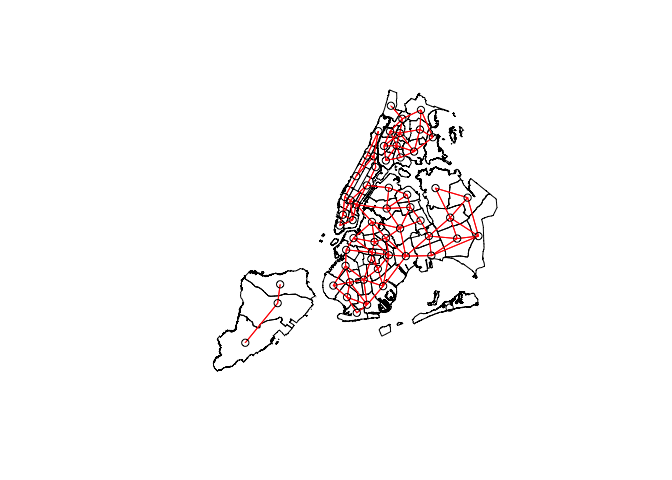<!-- -->

Next, calculate the spatial weights matrix.

``` r
spatial_weights <- nb2listw(nyc_neighbours, zero.policy = TRUE)
```

*Global Moran’s I*

Calculate Global Moran’s I for each parameter using moran.test().

``` r
no2_global_moran <- moran.test(CD_no2_sf$Mean..ppb., spatial_weights, zero.policy = TRUE)
pm2.5_global_moran <- moran.test(CD_pm2.5_sf$Mean..mcg.per.cubic.meter., spatial_weights, zero.policy = TRUE)
so2_global_moran <- moran.test(CD_so2_sf$Mean..ppb., spatial_weights, zero.policy = TRUE)
poverty_global_moran <- moran.test(CD_poverty_sf$Percent_in_poverty, spatial_weights, zero.policy = TRUE)
race_global_moran <- moran.test(CD_race_sf$X..of.population.non.white, spatial_weights, zero.policy = TRUE)
income_global_moran <- moran.test(CD_income_sf$Median_Income, spatial_weights, zero.policy = TRUE)
```

View the results. These are explained in the results section of the
report.

``` r
no2_global_moran
```

    ## 
    ##  Moran I test under randomisation
    ## 
    ## data:  CD_no2_sf$Mean..ppb.  
    ## weights: spatial_weights  n reduced by no-neighbour observations
    ##   
    ## 
    ## Moran I statistic standard deviate = 7.7017, p-value = 6.712e-15
    ## alternative hypothesis: greater
    ## sample estimates:
    ## Moran I statistic       Expectation          Variance 
    ##       0.726618104      -0.017543860       0.009335972

``` r
pm2.5_global_moran
```

    ## 
    ##  Moran I test under randomisation
    ## 
    ## data:  CD_pm2.5_sf$Mean..mcg.per.cubic.meter.  
    ## weights: spatial_weights  n reduced by no-neighbour observations
    ##   
    ## 
    ## Moran I statistic standard deviate = 8.1557, p-value < 2.2e-16
    ## alternative hypothesis: greater
    ## sample estimates:
    ## Moran I statistic       Expectation          Variance 
    ##       0.747066336      -0.017543860       0.008789425

``` r
so2_global_moran
```

    ## 
    ##  Moran I test under randomisation
    ## 
    ## data:  CD_so2_sf$Mean..ppb.  
    ## weights: spatial_weights  n reduced by no-neighbour observations
    ##   
    ## 
    ## Moran I statistic standard deviate = 6.8908, p-value = 2.774e-12
    ## alternative hypothesis: greater
    ## sample estimates:
    ## Moran I statistic       Expectation          Variance 
    ##       0.648103424      -0.017543860       0.009331405

``` r
poverty_global_moran
```

    ## 
    ##  Moran I test under randomisation
    ## 
    ## data:  CD_poverty_sf$Percent_in_poverty  
    ## weights: spatial_weights  n reduced by no-neighbour observations
    ##   
    ## 
    ## Moran I statistic standard deviate = 5.622, p-value = 9.435e-09
    ## alternative hypothesis: greater
    ## sample estimates:
    ## Moran I statistic       Expectation          Variance 
    ##       0.532667969      -0.017543860       0.009577919

``` r
race_global_moran
```

    ## 
    ##  Moran I test under randomisation
    ## 
    ## data:  CD_race_sf$X..of.population.non.white  
    ## weights: spatial_weights  n reduced by no-neighbour observations
    ##   
    ## 
    ## Moran I statistic standard deviate = 5.6407, p-value = 8.466e-09
    ## alternative hypothesis: greater
    ## sample estimates:
    ## Moran I statistic       Expectation          Variance 
    ##       0.538130393      -0.017543860       0.009704369

``` r
income_global_moran
```

    ## 
    ##  Moran I test under randomisation
    ## 
    ## data:  CD_income_sf$Median_Income  
    ## weights: spatial_weights  n reduced by no-neighbour observations
    ##   
    ## 
    ## Moran I statistic standard deviate = 4.6851, p-value = 1.399e-06
    ## alternative hypothesis: greater
    ## sample estimates:
    ## Moran I statistic       Expectation          Variance 
    ##       0.436652958      -0.017543860       0.009398468

Because the Global Moran’s I values indicate clustering, the Local
Moran’s I can be analysed.

*Local Moran’s I*

Calculate Local Moran’s I using localmoran().

``` r
no2_local_moran <- localmoran(CD_no2_sf$Mean..ppb., spatial_weights, zero.policy = TRUE)
pm2.5_local_moran <- localmoran(CD_pm2.5_sf$Mean..mcg.per.cubic.meter., spatial_weights, zero.policy = TRUE)
so2_local_moran <- localmoran(CD_so2_sf$Mean..ppb., spatial_weights, zero.policy = TRUE)
poverty_local_moran <- localmoran(CD_poverty_sf$Percent_in_poverty, spatial_weights, zero.policy = TRUE)
race_local_moran <- localmoran(CD_race_sf$X..of.population.non.white, spatial_weights, zero.policy = TRUE)
income_local_moran <- localmoran(CD_income_sf$Median_Income, spatial_weights, zero.policy = TRUE)
```

View the results. These are explained in the results section of the
report.

``` r
head(no2_local_moran)
```

    ##         Ii        E.Ii    Var.Ii      Z.Ii    Pr(z > 0)
    ## 1 2.681885 -0.01724138 0.4672813  3.948517 3.931835e-05
    ## 2 3.468870 -0.01724138 0.2257368  7.337364 1.089205e-13
    ## 3 2.331504 -0.01724138 0.2257368  4.943501 3.836590e-07
    ## 4 3.932475 -0.01724138 0.3062516  7.137181 4.763203e-13
    ## 5 5.141426 -0.01724138 0.1774279 12.246910 8.725927e-35
    ## 6 3.061125 -0.01724138 0.1774279  7.308183 1.353899e-13

``` r
head(pm2.5_local_moran)
```

    ##         Ii        E.Ii    Var.Ii      Z.Ii    Pr(z > 0)
    ## 1 2.619164 -0.01724138 0.4417787  3.966521 3.646472e-05
    ## 2 5.944555 -0.01724138 0.2139129 12.890170 2.556534e-38
    ## 3 3.907596 -0.01724138 0.2139129  8.486004 1.069322e-17
    ## 4 4.937123 -0.01724138 0.2898682  9.202116 1.754842e-20
    ## 5 7.691536 -0.01724138 0.1683397 18.788505 4.689201e-79
    ## 6 4.026310 -0.01724138 0.1683397  9.855295 3.251268e-23

``` r
head(so2_local_moran)
```

    ##           Ii        E.Ii    Var.Ii       Z.Ii   Pr(z > 0)
    ## 1 -0.4619848 -0.01724138 0.4670682 -0.6507579 0.742398595
    ## 2  0.2018001 -0.01724138 0.2256380  0.4611266 0.322353872
    ## 3  0.1179536 -0.01724138 0.2256380  0.2846128 0.387970420
    ## 4  0.2018001 -0.01724138 0.3061147  0.3958988 0.346089828
    ## 5  0.9955471 -0.01724138 0.1773520  2.4049207 0.008087988
    ## 6  0.4002369 -0.01724138 0.1773520  0.9913245 0.160763585

``` r
head(poverty_local_moran)
```

    ##           Ii        E.Ii    Var.Ii       Z.Ii   Pr(z > 0)
    ## 1  1.0989141 -0.01724138 0.4785708  1.6134354 0.053324969
    ## 2  1.4207632 -0.01724138 0.2309710  2.9921371 0.001385159
    ## 3 -0.3667855 -0.01724138 0.2309710 -0.7273161 0.766483821
    ## 4  1.4855646 -0.01724138 0.3135043  2.6839915 0.003637447
    ## 5  1.2384033 -0.01724138 0.1814511  2.9477251 0.001600608
    ## 6  1.1449226 -0.01724138 0.1814511  2.7282717 0.003183357

``` r
head(race_local_moran)
```

    ##            Ii        E.Ii    Var.Ii        Z.Ii    Pr(z > 0)
    ## 1  1.10134326 -0.01724138 0.4844712  1.60707032 5.401947e-02
    ## 2  1.56625251 -0.01724138 0.2337067  3.27552444 5.273299e-04
    ## 3 -0.03262135 -0.01724138 0.2337067 -0.03181413 5.126899e-01
    ## 4  1.56711105 -0.01724138 0.3172948  2.81267978 2.456528e-03
    ## 5  1.66849543 -0.01724138 0.1835538  3.93466832 4.165583e-05
    ## 6  1.27828991 -0.01724138 0.1835538  3.02389191 1.247728e-03

``` r
head(income_local_moran)
```

    ##          Ii        E.Ii    Var.Ii      Z.Ii    Pr(z > 0)
    ## 1  2.091844 -0.01724138 0.4701974  3.075771 1.049796e-03
    ## 2  2.780326 -0.01724138 0.2270888  5.870602 2.171078e-09
    ## 3 -2.057419 -0.01724138 0.2270888 -4.281246 9.999907e-01
    ## 4  2.591579 -0.01724138 0.3081250  4.699814 1.301995e-06
    ## 5  1.917600 -0.01724138 0.1784671  4.580008 2.324790e-06
    ## 6  1.458233 -0.01724138 0.1784671  3.492630 2.391443e-04

The results of the Local Moran’s I analysis can be mapped. To do so, the
results are combined with the Community Districts shapefile.

``` r
no2_local_moran_map <- cbind(nyc_community_districts, no2_local_moran)
names(no2_local_moran_map)[5] <- 'Local Morans I'

pm2.5_local_moran_map <- cbind(nyc_community_districts, pm2.5_local_moran)
names(pm2.5_local_moran_map)[5] <- 'Local Morans I'

so2_local_moran_map <- cbind(nyc_community_districts, so2_local_moran)
names(so2_local_moran_map)[5] <- 'Local Morans I'

poverty_local_moran_map <- cbind(nyc_community_districts, poverty_local_moran)
names(poverty_local_moran_map)[5] <- 'Local Morans I'

race_local_moran_map <- cbind(nyc_community_districts, race_local_moran)
names(race_local_moran_map)[5] <- 'Local Morans I'

income_local_moran_map <- cbind(nyc_community_districts, income_local_moran)
names(income_local_moran_map)[5] <- 'Local Morans I'
```

Using tmap, the results can be plotted.

``` r
tm_shape(no2_local_moran_map) +
  tm_fill(col = "Local Morans I",
          style = "pretty",
          palette = 'PRGn') +
  tm_borders(alpha = 0.2) +
  tm_layout(main.title = 'Local Morans I of NO2 concentration',
            main.title.position = 'centre',
            frame = FALSE) +
  tm_compass(position = c('right', 'bottom')) +
  tm_scale_bar(position = c('right', 'bottom'), width = 0.3)
```

    ## Variable(s) "Local Morans I" contains positive and negative values, so midpoint is set to 0. Set midpoint = NA to show the full spectrum of the color palette.

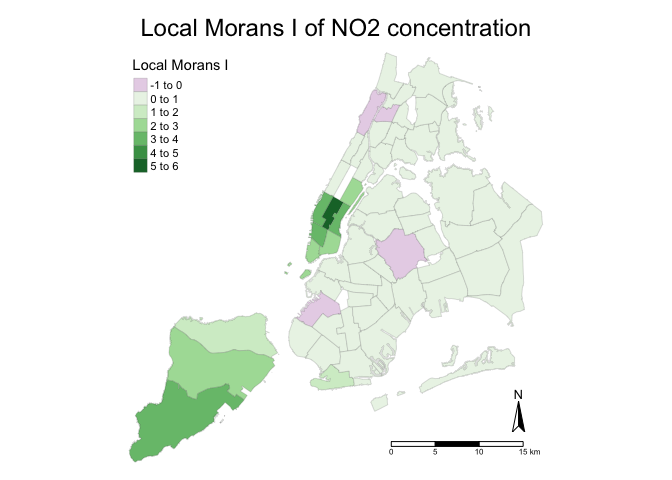<!-- -->

``` r
tm_shape(pm2.5_local_moran_map) +
  tm_fill(col = "Local Morans I",
          style = "pretty",
          palette = 'PRGn') +
  tm_borders(alpha = 0.2) +
  tm_layout(main.title = 'Local Morans I of PM2.5 concentration',
            main.title.position = 'centre',
            frame = FALSE) +
  tm_compass(position = c('right', 'bottom')) +
  tm_scale_bar(position = c('right', 'bottom'), width = 0.3)
```

    ## Variable(s) "Local Morans I" contains positive and negative values, so midpoint is set to 0. Set midpoint = NA to show the full spectrum of the color palette.

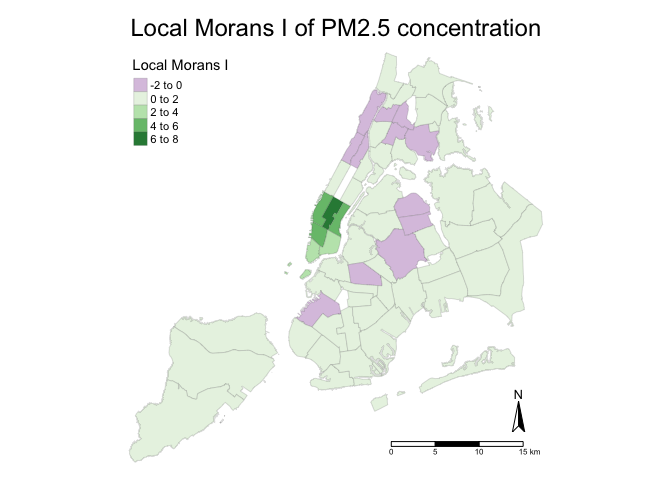<!-- -->

``` r
tm_shape(so2_local_moran_map) +
  tm_fill(col = "Local Morans I",
          style = "pretty",
          palette = 'PRGn') +
  tm_borders(alpha = 0.2) +
  tm_layout(main.title = 'Local Morans I of SO2 concentration',
            main.title.position = 'centre',
            frame = FALSE) +
  tm_compass(position = c('right', 'bottom')) +
  tm_scale_bar(position = c('right', 'bottom'), width = 0.3)
```

    ## Variable(s) "Local Morans I" contains positive and negative values, so midpoint is set to 0. Set midpoint = NA to show the full spectrum of the color palette.

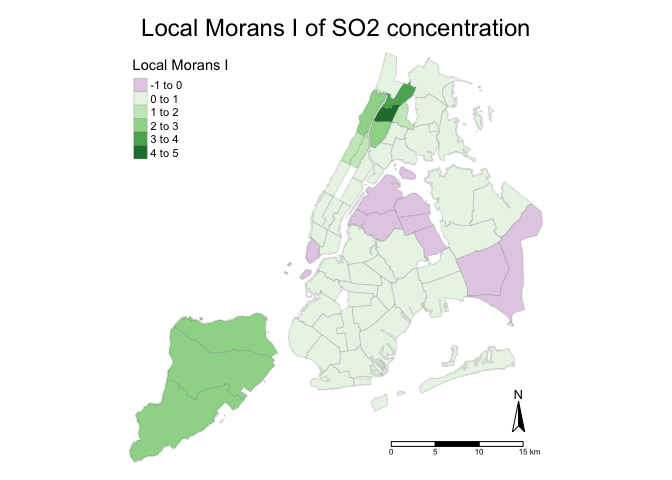<!-- -->

``` r
tm_shape(poverty_local_moran_map) +
  tm_fill(col = "Local Morans I",
          style = "pretty",
          palette = 'PRGn') +
  tm_borders(alpha = 0.2) +
  tm_layout(main.title = 'Local Morans I of poverty distribution',
            main.title.position = 'centre',
            frame = FALSE) +
  tm_compass(position = c('right', 'bottom')) +
  tm_scale_bar(position = c('right', 'bottom'), width = 0.3)
```

    ## Variable(s) "Local Morans I" contains positive and negative values, so midpoint is set to 0. Set midpoint = NA to show the full spectrum of the color palette.

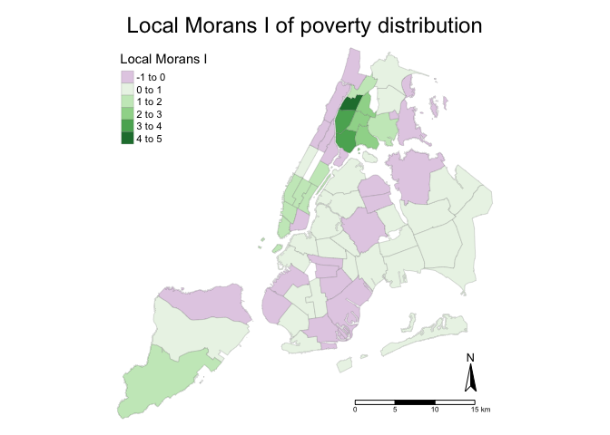<!-- -->

``` r
tm_shape(race_local_moran_map) +
  tm_fill(col = "Local Morans I",
          style = "pretty",
          palette = 'PRGn') +
  tm_borders(alpha = 0.2) +
  tm_layout(main.title = 'Local Morans I of racial distribution',
            main.title.position = 'centre',
            frame = FALSE) +
  tm_compass(position = c('right', 'bottom')) +
  tm_scale_bar(position = c('right', 'bottom'), width = 0.3)
```

    ## Variable(s) "Local Morans I" contains positive and negative values, so midpoint is set to 0. Set midpoint = NA to show the full spectrum of the color palette.

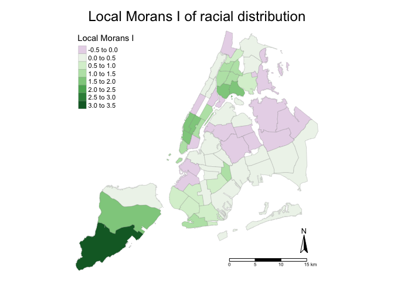<!-- -->

``` r
tm_shape(income_local_moran_map) +
  tm_fill(col = "Local Morans I",
          style = "pretty",
          palette = 'PRGn') +
  tm_borders(alpha = 0.2) +
  tm_layout(main.title = 'Local Morans I of income distribution',
            main.title.position = 'centre',
            frame = FALSE) +
  tm_compass(position = c('right', 'bottom')) +
  tm_scale_bar(position = c('right', 'bottom'), width = 0.3)
```

    ## Variable(s) "Local Morans I" contains positive and negative values, so midpoint is set to 0. Set midpoint = NA to show the full spectrum of the color palette.

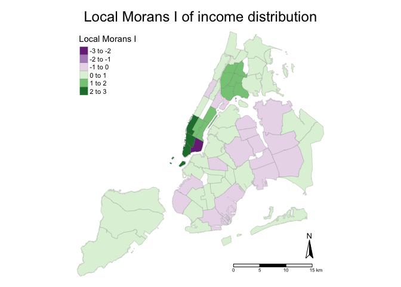<!-- -->

\_Getis Ord Gi\*\_

Finally, Getis Ord Gi\* can be calculated to indicate ‘hot and cold
spots’ in the data.

``` r
Gi_no2 <- localG(CD_no2_sf$Mean..ppb., spatial_weights, zero.policy = TRUE)
CD_Gi_no2 <- cbind(nyc_community_districts, as.matrix(Gi_no2))
names(CD_Gi_no2)[5] <- 'Getis Ord Gi*'

Gi_pm2.5 <- localG(CD_pm2.5_sf$Mean..mcg.per.cubic.meter., spatial_weights, zero.policy = TRUE)
CD_Gi_pm2.5 <- cbind(nyc_community_districts, as.matrix(Gi_pm2.5))
names(CD_Gi_pm2.5)[5] <- 'Getis Ord Gi*'

Gi_so2 <- localG(CD_so2_sf$Mean..ppb., spatial_weights, zero.policy = TRUE)
CD_Gi_so2 <- cbind(nyc_community_districts, as.matrix(Gi_so2))
names(CD_Gi_so2)[5] <- 'Getis Ord Gi*'

Gi_poverty <- localG(CD_poverty_sf$Percent_in_poverty, spatial_weights, zero.policy = TRUE)
CD_Gi_poverty <- cbind(nyc_community_districts, as.matrix(Gi_poverty))
names(CD_Gi_poverty)[5] <- 'Getis Ord Gi*'

Gi_race <- localG(CD_race_sf$X..of.population.non.white, spatial_weights, zero.policy = TRUE)
CD_Gi_race <- cbind(nyc_community_districts, as.matrix(Gi_race))  
names(CD_Gi_race)[5] <- 'Getis Ord Gi*'

Gi_income <- localG(CD_income_sf$Median_Income, spatial_weights, zero.policy = TRUE)
CD_Gi_income <- cbind(nyc_community_districts, as.matrix(Gi_income))
names(CD_Gi_income)[5] <- 'Getis Ord Gi*'
```

These results can be mapped using tmap.

``` r
tm_shape(CD_Gi_no2) +
  tm_fill("Getis Ord Gi*",
          palette = '-RdBu',
          style = 'pretty') +
  tm_borders(alpha = 0.2) +
  tm_layout(main.title = "Hot and cold spots of NO2 Concentration",
            main.title.position = 'centre',
            frame = FALSE) +
  tm_compass(position = c('right', 'bottom')) +
  tm_scale_bar(position = c('right', 'bottom'), width = 0.3)
```

    ## Variable(s) "Getis Ord Gi*" contains positive and negative values, so midpoint is set to 0. Set midpoint = NA to show the full spectrum of the color palette.

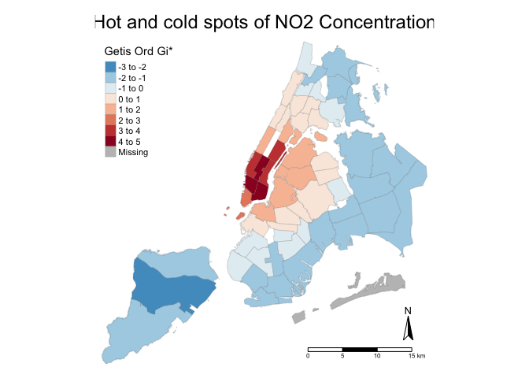<!-- -->

``` r
tm_shape(CD_Gi_pm2.5) +
  tm_fill("Getis Ord Gi*",
          palette = '-RdBu',
          style = 'pretty') +
  tm_borders(alpha = 0.2) +
  tm_layout(main.title = "Hot and cold spots of PM2.5 Concentration",
            main.title.position = 'centre',
            frame = FALSE) +
  tm_compass(position = c('right', 'bottom')) +
  tm_scale_bar(position = c('right', 'bottom'), width = 0.3)
```

    ## Variable(s) "Getis Ord Gi*" contains positive and negative values, so midpoint is set to 0. Set midpoint = NA to show the full spectrum of the color palette.

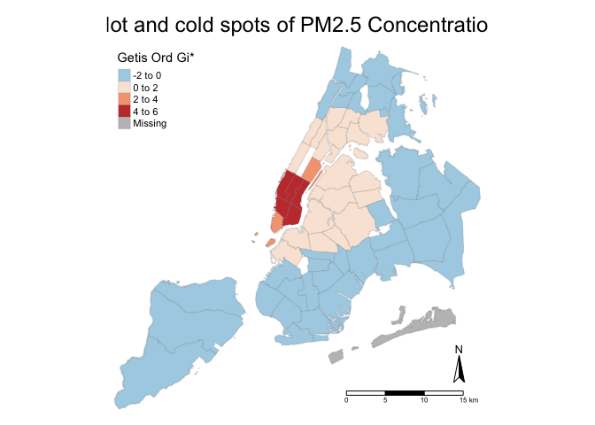<!-- -->

``` r
tm_shape(CD_Gi_so2) +
  tm_fill("Getis Ord Gi*",
          palette = '-RdBu',
          style = 'pretty') +
  tm_borders(alpha = 0.2) +
  tm_layout(main.title = "Hot and cold spots of SO2 Concentration",
            main.title.position = 'centre',
            frame = FALSE) +
  tm_compass(position = c('right', 'bottom')) +
  tm_scale_bar(position = c('right', 'bottom'), width = 0.3)
```

    ## Variable(s) "Getis Ord Gi*" contains positive and negative values, so midpoint is set to 0. Set midpoint = NA to show the full spectrum of the color palette.

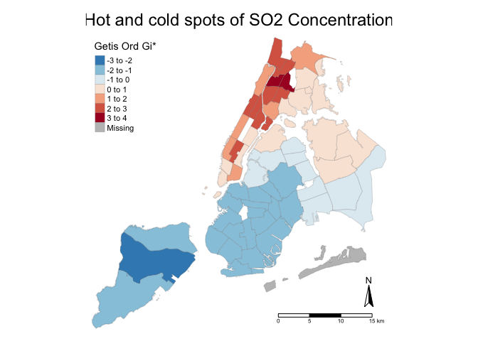<!-- -->

``` r
tm_shape(CD_Gi_poverty) +
  tm_fill("Getis Ord Gi*",
          palette = '-RdBu',
          style = 'pretty') +
  tm_borders(alpha = 0.2) +
  tm_layout(main.title = "Hot and cold spots of Poverty distribution",
            main.title.position = 'centre',
            frame = FALSE) +
  tm_compass(position = c('right', 'bottom')) +
  tm_scale_bar(position = c('right', 'bottom'), width = 0.3)
```

    ## Variable(s) "Getis Ord Gi*" contains positive and negative values, so midpoint is set to 0. Set midpoint = NA to show the full spectrum of the color palette.

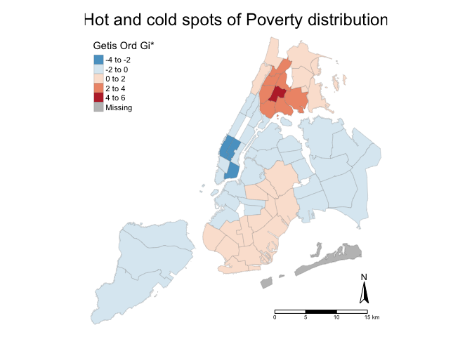<!-- -->

``` r
tm_shape(CD_Gi_race) +
  tm_fill("Getis Ord Gi*",
          palette = '-RdBu',
          style = 'pretty') +
  tm_borders(alpha = 0.2) +
  tm_layout(main.title = "Hot and cold spots of racial distribution",
            main.title.position = 'centre',
            frame = FALSE) +
  tm_compass(position = c('right', 'bottom')) +
  tm_scale_bar(position = c('right', 'bottom'), width = 0.3)
```

    ## Variable(s) "Getis Ord Gi*" contains positive and negative values, so midpoint is set to 0. Set midpoint = NA to show the full spectrum of the color palette.

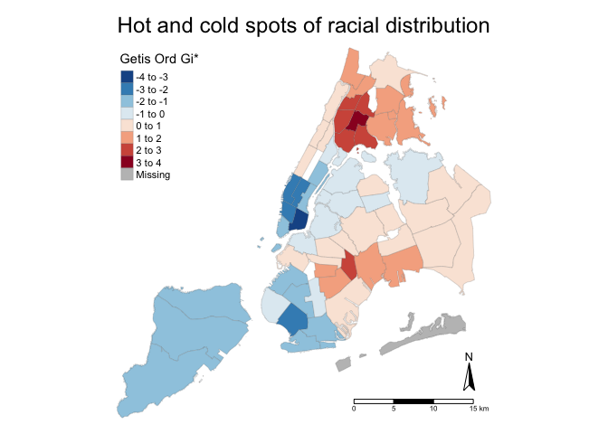<!-- -->

``` r
tm_shape(CD_Gi_income) +
  tm_fill("Getis Ord Gi*",
          palette = '-RdBu',
          style = 'pretty') +
  tm_borders(alpha = 0.2) +
  tm_layout(main.title = "Hot and cold spots of income distribution",
            main.title.position = 'centre',
            frame = FALSE) +
  tm_compass(position = c('right', 'bottom')) +
  tm_scale_bar(position = c('right', 'bottom'), width = 0.3)
```

    ## Variable(s) "Getis Ord Gi*" contains positive and negative values, so midpoint is set to 0. Set midpoint = NA to show the full spectrum of the color palette.

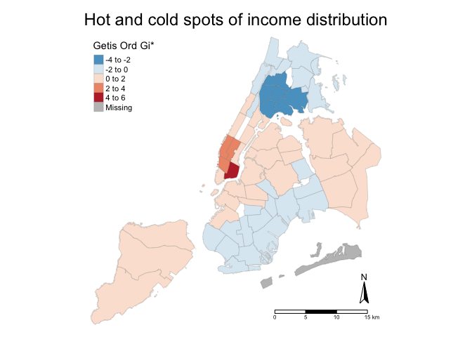<!-- -->
